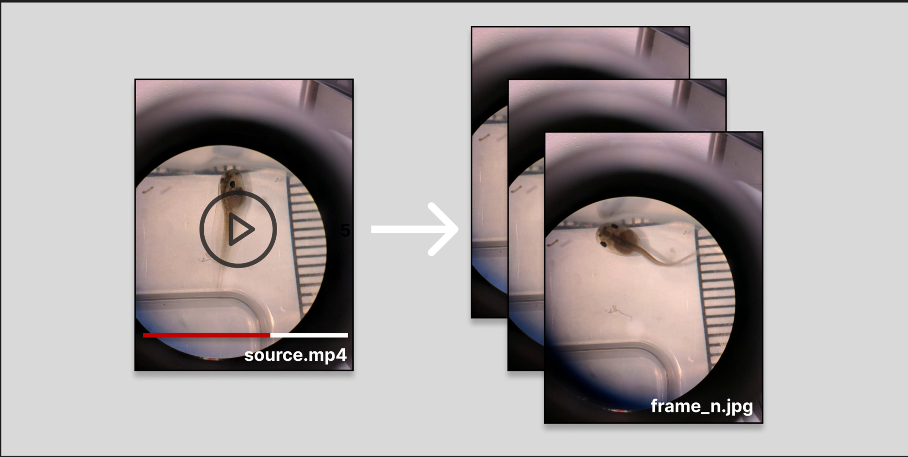

# peakframer

Extract maximally diverse frames from video using visual embeddings.



Unlike fixed time-interval sampling tools like [ffmpeg's thumbnail](https://trac.ffmpeg.org/wiki/Create%20a%20thumbnail%20image%20every%20X%20seconds%20of%20the%20video) tool or scene-based video tools like [PySceneDetect](https://www.scenedetect.com/), **peakframer** uses [Contrastive Language-Image Pre-training (CLIP)](https://en.wikipedia.org/wiki/Contrastive_Language-Image_Pre-training) embeddings and [k-means clustering](https://scikit-learn.org/stable/modules/generated/sklearn.cluster.KMeans.html) to select frames that are as statistically visually distinct from each other as possible. 

This project originated from the need to diversify computer vision model datasets that lack edge-case coverage; specifically, datasets of tadpoles under a microscope where motion events are rare but critical to model performance.

## Install
```bash
uv sync --group dev
```

## Usage
```bash
peakframer --version

peakframer video.mp4 --count 50
peakframer video.mp4 --count 100 --output ./frames --sample-rate 10
peakframer video.mp4 --count 50 --debug
```

## How it works

1. Decode every Nth frame from the video (using --sample-rate or auto-sample mode)
2. Embed each frame with CLIP (ViT-B/32)
3. Cluster embeddings with k-means (k = count * oversample_rate)
4. Save the frame closest to each centroid
5. Benchmark the diversity of extracted frames against an averaged random sampling baseline

## License

Apache 2.0

## Disclaimer

This project was developed with the assistance of AI tools.
